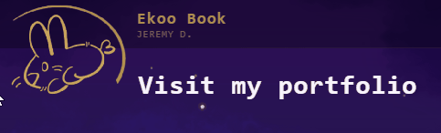

<div align="center">


[](https://git.io/typing-svg)

<a href="https://github.com/jydzip"></a>


</div>

<br/>

## 🐇 About me

Hey, I'm **jydzip**, a.k.a. the **Rabbit Knight**. 🌱

I'm a **Web Developer** & **Digital Creator** who enjoys building projects where technology, creativity and user experience come together.

I mainly work with TypeScript, React, Next.js and React Native, while also developing backend services and exploring technologies such as Go, Python, Docker and Linux.

I particularly enjoy creating tools rather than simply using them : from web applications and APIs to image/video editing experiences, creative interfaces and experimental projects.

```ts
const me = {
  role: "Web Developer & Digital Creator",
  interests: [
    "Web & Mobile",
    "Creative tools",
    "Image & Video",
    "UI / UX",
    "Backend & APIs",
    "Infrastructure",
    "Game Development",
  ],
  mindset: "Build it, understand it, improve it.",
};
```

<br/>

<div align="center">
  <a href="https://ekoobook.com/"></a>
</div>

## 🧰 Tech stack

<table>
  <tr>
    <td width="170"><b>Languages</b></td>
    <td></td>
  </tr>
  <tr>
    <td><b>Frameworks & Libraries</b></td>
    <td>
      
      
    </td>
  </tr>
  <tr>
    <td><b>Game Dev</b></td>
    <td></td>
  </tr>
  <tr>
    <td><b>Tools & Design</b></td>
    <td></td>
  </tr>
</table>

<br/>

## 🚀 Projects

<table>
  <tr>
    <td width="50%" valign="top">
      <h3><a href="https://ekoobook.com/en/projects/pixlub">Pixlub</a></h3>
      A modern web-based image and video editing platform, focused on modular editing experiences and creative workflows.
      <br/><br/>
      
    </td>
    <td width="50%" valign="top">
      <h3><a href="https://ekoobook.com/en/projects/mixivente">MixiVente</a></h3>
      A European C2C marketplace concept connecting individuals and professionals through a modern web & mobile experience.
      <br/><br/>
      
    </td>
  </tr>
  <tr>
    <td width="50%" valign="top">
      <h3><a href="https://github.com/jydzip/sod_rabbits">🐰 sod_rabbits</a></h3>
      <sub>Rabbits - SOD Presentation</sub>
      <br/><br/>
      A presentation on the theme of rabbits, shown at the Holberton School campus.
      <br/><br/>
      
    </td>
    <td width="50%" valign="top">
      <h3><a href="https://github.com/jydzip/sod_canard_colvert">🐰 sod_canard_colvert</a></h3>
      <sub>Canard Covert - SOD Presentation</sub>
      <br/><br/>
      A presentation on the theme of duck, shown at the Holberton School campus.
      <br/><br/>
      
    </td>
  </tr>
</table>

<div align="center">
  <a href="https://github.com/jydzip?tab=repositories"></a>
</div>

<br/>

## 📊 GitHub stats

<div align="center">
  
  
</div>

<br/>

<div align="center">
  
</div>
